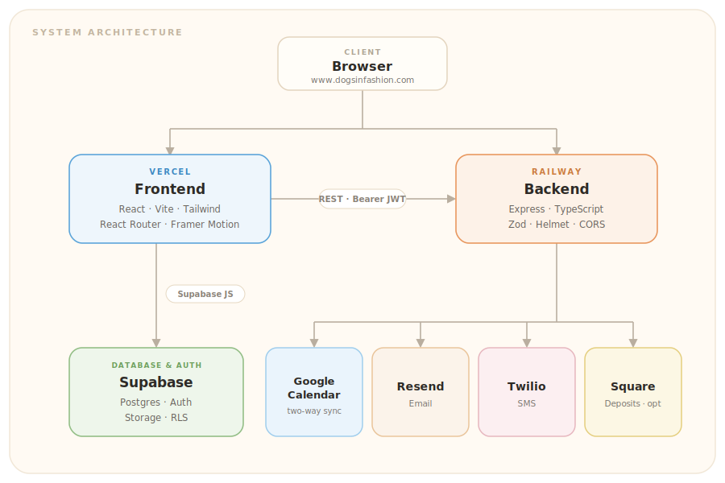

<div align="center">

# 🐾 Dogs in Fashion

### Mobile dog grooming, booked in a few taps.

A full-stack booking platform for a real mobile grooming business serving the
greater **Davis &amp; Sacramento** area — from the marketing site customers land on,
to the booking wizard, to the admin dashboard the groomer runs the business from.

[**🌐 Live Site**](https://www.dogsinfashion.com) · [Report a Bug](https://github.com/arianapan/dogsinfashion/issues) · [Request a Feature](https://github.com/arianapan/dogsinfashion/issues)

<br />


</div>

---

## ✨ Overview

**Dogs in Fashion** is a mobile pet-grooming service — the groomer drives to the
customer's door, so the dog gets a spa day with no stressful car ride. This repo
is the platform behind it: a polished marketing landing page, a self-service
booking flow with **live availability**, customer pet profiles, and a full
**admin dashboard** with analytics, scheduling, and automated reminders.

It's built as two independent apps — a **React frontend** (Vercel) and an
**Express API** (Railway) — backed by **Supabase** and wired into Google
Calendar, Resend, Twilio, and Square.

---

## 🌟 Features

### For customers
- 🎨 **Marketing site** — animated hero, services, add-ons, before/after gallery, service areas, and "how it works."
- 🔐 **Passwordless auth** — sign in with Google OAuth or a one-time email code (with a password-recovery flow).
- 📅 **Booking wizard** — pick a service → choose a slot → add pet details → confirm. Availability is computed in real time by merging existing bookings *and* the groomer's Google Calendar free/busy.
- 🐕 **Pet profiles** — save your dogs, breeds, sizes, notes, and photos; reuse them on future bookings.
- 🗂️ **My Bookings** — view upcoming &amp; past appointments, **reschedule**, or cancel.
- 📧 **Confirmations &amp; reminders** — instant confirmation email (with a calendar `.ics` invite) plus automated reminders before the appointment.

### For the groomer (admin)
- 📊 **Analytics** — revenue cards &amp; trends, service breakdown, busiest times, and customer insights (powered by Recharts).
- 🗓️ **Schedule management** — edit weekly working hours and block off dates/time ranges.
- ✅ **Booking management** — filter, mark complete, cancel, or reschedule any appointment.
- ➕ **Create bookings** — book on a customer's behalf straight from the dashboard.
- 👥 **Customer directory** — see every user and their latest contact info.
- 🔔 **Reminder settings** — configure lead times for email/SMS reminders.

### Behind the scenes
- 🔄 **Two-way Google Calendar sync** — bookings create calendar events; the groomer's existing events block out slots.
- ⏰ **Reminder scheduler** — a background job sends pending email/SMS reminders on schedule.
- 💳 **Square deposits** — optional, feature-flagged deposit collection at booking time (off by default).
- 🛡️ **Row-Level Security** — Supabase RLS keeps every customer scoped to their own data.

---

## 🏗️ Architecture

<div align="center">
  
</div>

The frontend and backend are **completely separate npm projects** (no workspace) —
each has its own `package.json` and deploys independently. The root `package.json`
only carries `concurrently` so you can boot both with one command in local dev.

---

## 🧰 Tech Stack

| Layer | Technologies |
|-------|-------------|
| **Frontend** | React 18 · TypeScript · Vite 6 · Tailwind CSS 3 · React Router 7 · Framer Motion · Recharts · Lucide |
| **Backend** | Node 20+ · Express 4 · TypeScript · Zod · Helmet · CORS |
| **Database &amp; Auth** | Supabase (PostgreSQL · Auth · Storage · Row-Level Security) |
| **Integrations** | Google Calendar API · Resend (email) · Twilio (SMS) · Square (payments) |
| **Hosting** | Vercel (frontend) · Railway (backend) · Supabase (database) |

---

## 📁 Project Structure

```
dogsinfashion/
├── package.json            # root — just `concurrently` to run FE + BE together
├── .env.example            # all environment variables, documented
├── frontend/               # → deploys to Vercel
│   ├── src/
│   │   ├── pages/          # Home, Login, Booking, MyBookings, MyPets, Admin…
│   │   ├── components/     # marketing sections, booking UI, admin/, analytics/
│   │   ├── context/        # AuthContext (Supabase session + role)
│   │   ├── lib/            # supabase client, api fetch wrapper
│   │   └── data/           # services & pricing (single source of truth)
│   └── vercel.json         # SPA rewrites
├── backend/                # → deploys to Railway
│   ├── src/
│   │   ├── routes/         # auth, bookings, availability, pets, reminders, admin-users
│   │   ├── services/       # supabase, google-calendar, email, sms, square, slots
│   │   ├── jobs/           # reminder-scheduler, calendar-sync
│   │   ├── middleware/     # auth (Bearer) + admin guards
│   │   └── config.ts       # Zod-validated env config
│   └── railway.toml        # Railway build config
├── sql/                    # dated Supabase migrations
├── email-templates/        # Supabase auth email templates
└── docs/                   # infrastructure, deployment & planning notes
```

---

## 🚀 Getting Started

### Prerequisites
- **Node.js ≥ 20**
- A **Supabase** project (Postgres + Auth)
- *(Optional)* Google Cloud service account, Resend, Twilio, and Square accounts —
  every integration **degrades gracefully** if its keys are absent, so you can run
  the core app with just Supabase.

### 1. Clone &amp; install

```bash
git clone https://github.com/arianapan/dogsinfashion.git
cd dogsinfashion

# install each app (they're independent projects)
cd frontend && npm install && cd ..
cd backend  && npm install && cd ..
npm install            # root — installs concurrently only
```

### 2. Configure environment

Copy `.env.example` and fill in your keys. There are two env files:

```bash
cp .env.example frontend/.env.local   # then trim to the VITE_* vars
cp .env.example backend/.env          # then trim to the backend vars
```

- `frontend/.env.local` — Supabase URL/anon key, API URL (leave blank locally; Vite proxies `/api` → `:3001`), and Square public config.
- `backend/.env` — Supabase service-role key plus integration secrets.

See [Environment Variables](#-environment-variables) below for the full list.

### 3. Set up the database

Run the migrations in [`sql/`](./sql) (in date order) from the **Supabase SQL Editor**,
then enable **Google** and **Email** providers under *Authentication → Providers*.

### 4. Run it

```bash
npm run dev          # starts frontend (:5173) + backend (:3001) together
```

| Command | What it does |
|---------|-------------|
| `npm run dev` | Run frontend **and** backend concurrently |
| `npm run dev:fe` | Frontend only (Vite, port 5173) |
| `npm run dev:be` | Backend only (tsx watch, port 3001) |
| `npm run build` | Type-check &amp; build both apps |

Then open **http://localhost:5173**. Health check: `curl http://localhost:3001/api/health`.

---

## 🔑 Environment Variables

> Secrets live only in Vercel/Railway/Supabase — `.env` files are git-ignored and never committed.

### Frontend (`frontend/.env.local`)

| Variable | Description |
|----------|-------------|
| `VITE_SUPABASE_URL` | Supabase project URL |
| `VITE_SUPABASE_ANON_KEY` | Supabase public anon key |
| `VITE_API_URL` | Backend URL (leave empty in dev — Vite proxies `/api`) |
| `VITE_DEPOSIT_REQUIRED` | Feature flag for Square deposits (`false` by default) |
| `VITE_SQUARE_APPLICATION_ID` / `VITE_SQUARE_LOCATION_ID` / `VITE_SQUARE_ENVIRONMENT` | Square Web Payments config |

### Backend (`backend/.env`)

| Variable | Description |
|----------|-------------|
| `PORT` / `NODE_ENV` | Server port (default `3001`) &amp; environment |
| `FRONTEND_URL` | Allowed CORS origin |
| `SUPABASE_URL` / `SUPABASE_SERVICE_ROLE_KEY` | Supabase admin access |
| `GOOGLE_SERVICE_ACCOUNT_KEY` / `DORIS_CALENDAR_ID` | Google Calendar sync *(optional)* |
| `RESEND_API_KEY` / `DORIS_EMAIL` | Transactional email via Resend *(optional)* |
| `TWILIO_ACCOUNT_SID` / `TWILIO_AUTH_TOKEN` / `TWILIO_PHONE_NUMBER` / `DORIS_PHONE` | SMS reminders *(optional)* |
| `DEPOSIT_REQUIRED` / `DEPOSIT_AMOUNT_CENTS` / `SQUARE_*` | Square deposit payments *(optional, off by default)* |

---

## 🛣️ API Reference

All routes are prefixed with `/api`. Protected routes expect an
`Authorization: Bearer <supabase-jwt>` header; admin routes additionally require
the `admin` role.

| Method | Endpoint | Auth | Description |
|--------|----------|------|-------------|
| `GET` | `/health` | — | Health check |
| `GET` | `/auth/me` | 🔒 | Current user + role |
| `GET` | `/availability/slots` | — | Open slots for a date &amp; service |
| `GET` | `/availability/schedule` | 👑 | Weekly hours + blocked dates |
| `PUT` | `/availability/schedule` | 👑 | Update weekly hours |
| `POST` | `/availability/blocked-dates` | 👑 | Block a date/time range |
| `DELETE` | `/availability/blocked-dates/:id` | 👑 | Unblock a date |
| `POST` | `/bookings` | 🔒 | Create a booking |
| `POST` | `/bookings/with-deposit` | 🔒 | Create a booking + Square deposit |
| `GET` | `/bookings` | 🔒 | List bookings (own, or all for admin) |
| `GET` | `/bookings/:id` | 🔒 | Booking detail |
| `PATCH` | `/bookings/:id/status` | 🔒 | Mark completed / cancelled |
| `PATCH` | `/bookings/:id/reschedule` | 🔒 | Reschedule |
| `POST` | `/bookings/admin` | 👑 | Create a booking for a customer |
| `GET · POST` | `/pets` | 🔒 | List / create pets |
| `GET · PATCH · DELETE` | `/pets/:id` | 🔒 | Read / update / delete a pet |
| `GET · PUT` | `/reminders/settings` | 👑 | Read / update reminder settings |
| `GET` | `/admin/users` | 👑 | Customer directory |

<sub>🔒 = signed-in · 👑 = admin only</sub>

---

## 💅 Services &amp; Pricing

| Service | Small (&lt;20 lbs) | Medium (20–50 lbs) | Large (&gt;50 lbs) |
|---------|:-----:|:------:|:-----:|
| **Bath** (Essential) | $70 | $85 | $110 |
| **Full Groom** (Luxury) | $110 | $140 | $185 |

**Add-ons:** Nail Trim ($12) · Nail Grind + Trim ($19) · Teeth Brushing ($12) ·
Anal Gland Expression ($12) · Deep Coat Conditioner ($18) · Paw &amp; Nose Balm ($10)

> Pricing lives in [`frontend/src/data/services.ts`](./frontend/src/data/services.ts) — the single source of truth shared by the service picker and booking flow.

---

## ☁️ Deployment

Every push to `main` auto-deploys both apps — no manual steps.

```
git push origin main
        │
        ├──────────────▶  Vercel   builds & ships the frontend  (~1 min)
        └──────────────▶  Railway  builds & ships the backend   (~2 min)
```

| Component | Platform | Notes |
|-----------|----------|-------|
| Frontend | **Vercel** | Root dir `frontend`, Vite preset, Node 20 |
| Backend | **Railway** | Root dir `backend`, Nixpacks (`railway.toml`) |
| Database / Auth | **Supabase** | Postgres + Auth + Storage |
| DNS | **Squarespace** | `www.dogsinfashion.com` |

More detail in [`docs/INFRASTRUCTURE.md`](./docs/INFRASTRUCTURE.md) and
[`docs/DEPLOYMENT-GUIDE.md`](./docs/DEPLOYMENT-GUIDE.md).

---

## 🗺️ Roadmap

- [x] Auth, booking flow &amp; real-time availability
- [x] Google Calendar two-way sync
- [x] Admin dashboard + analytics
- [x] Email &amp; SMS reminders
- [x] Pet profiles &amp; photos
- [x] Square deposit payments (feature-flagged)
- [ ] Recurring appointments
- [ ] Google Calendar push webhooks (live two-way edits)

---

<div align="center">

Made with 🐶 for **Dogs in Fashion** · Davis &amp; Sacramento, CA

</div>
